# Human-Robot Safety

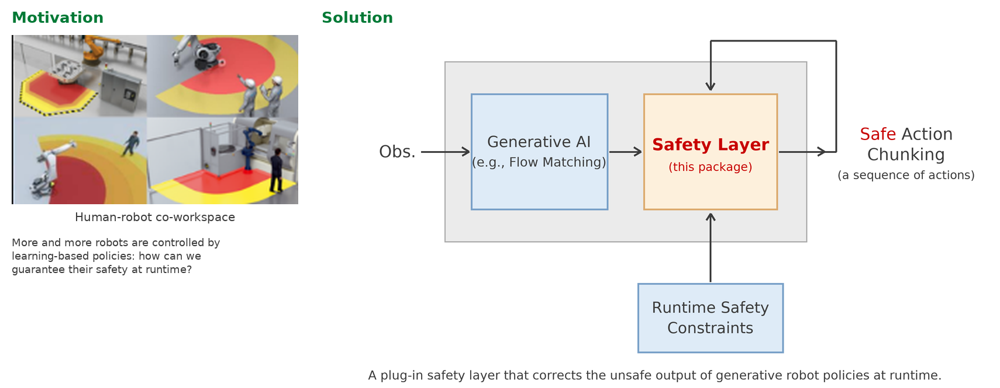

More and more robots are controlled by learning-based policies. **How can we guarantee their safety at runtime?**
This repository is about the safety of learning-based policies.
Our solution is a **plug-in safety layer for frozen flow-matching VLA policies** (e.g., pi0.5, GR00T N1.7).
It acts at inference time and never changes the pretrained weights of the policy.

The setup has two components:

1. **Runtime safety constraints** ([Step 1](#-step-1-constraint-functions)).
   At inference time you can define the constraints the robot must satisfy as differentiable cost functions on the
   action chunk. We provide two examples: *static obstacles* (e.g., assets in the environment) and
   *dynamic obstacles* (e.g., a human moving in the shared workspace).
2. **Your pretrained policy + our safety layer** ([Step 2](#%EF%B8%8F-step-2-incorporating-the-safety-layer-into-a-flow-policy)).
   The layer steers the output of the VLA policy by adding two terms to its base velocity:
   * a guidance term `g` from the constraint cost;
   * optionally, an off-manifold correction term (CAR), because naively editing the action can push it off
     the action manifold.

   In most environments the guidance term alone already raises the safe success rate and lowers the violation
   rate. The correction term fixes some corner cases of off-manifold drift but adds a lot of latency, so
   guidance alone is usually the right choice.

We evaluate on LIBERO with the two constraints (static pillars, a moving human arm) for pi0.5 and GR00T N1.7
(see [Results](#-results)).

---

## 🧱 Step 1: Constraint functions

A constraint is a differentiable cost `J(â)` on the policy's predicted action chunk `â`. The layer maps `â` to the
end-effector path and to a sphere model of the robot (gripper, forearm links, held object), so a constraint only has
to say how far those spheres must stay from something. The two built-in constraints are **control barrier functions
(CBF)** on that clearance: the robot may approach an obstacle at a rate proportional to its current distance and never
crosses a small safety margin. All they need from the environment is the **approximate location of the obstacles**;
no map, no retraining.

<table><tr>
<td width="50%" align="center">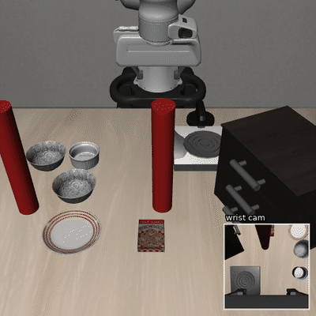<br><sub><b>Example 1</b> — static obstacles: two pillars on the policy's path (unseen in training).</sub></td>
<td width="50%" align="center">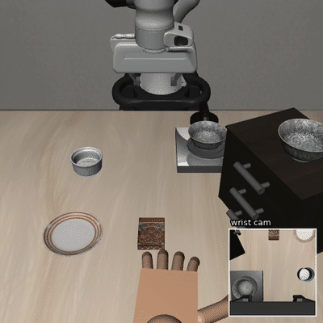<br><sub><b>Example 2</b> — dynamic obstacle: a human arm reaching for the same object. </sub></td>
</tr></table>

**Example 1 — static obstacles** ([`StaticObstacleTask`](safeguide/tasks.py)): obstacles are vertical cylinders
(centre, radius, height) read from the scene, e.g. pillars, fixtures, table edges. Comes with two episode heuristics,
arm-margin release after passing the obstacle and a deadlock escape.

**Example 2 — dynamic obstacle, a human arm** ([`DynamicObstacleTask`](safeguide/tasks.py),
[`HumanArmTrack`](safeguide/scene/human_arm.py)): the arm is tracked as two capsules (elbow → wrist → fingertip),
its pose is extrapolated over the coming chunk, and the capsule radii are inflated by a human-safety margin plus a
reaction-time allowance. No escape: retreating and waiting for the arm to pass is the desired behaviour.

```python
import safeguide as sg
layer = sg.compose(adapter, robot, sg.StaticObstacleTask(scene)).install()       # example 1
layer = sg.compose(adapter, robot, sg.DynamicObstacleTask.tight()).install()     # example 2 (feed .track.observe(elbow, tip) every step)
layer = sg.compose(adapter, robot, static_task, dynamic_task).install()          # both
```

The exact barrier and cost definitions are in [`safeguide/tasks.py`](safeguide/tasks.py) (docstring) and
[`safeguide/core/cost.py`](safeguide/core/cost.py).

### Define your own constraint

Two entry points, from light to full control:

**(a) New obstacle geometry, same barrier.** Implement the `Scene` interface (`safeguide/scene/base.py`): return
cylinders and/or capsules (with predicted poses over the chunk). On a real robot this is where the **detected obstacle
locations** go in: fit vertical cylinders to the obstacle point cloud (or read them from a workspace map) and return
them from `cylinders()`; feed the tracked human joints (elbow, fingertip) to `HumanArmTrack.observe()` every control
step and it returns the predicted, margin-inflated capsules from `capsules(H)`. Nothing else changes; the barrier and
the push are the same as in simulation. Template: [`examples/scene_template.py`](examples/scene_template.py).

```python
class MyScene(sg.Scene):
    def cylinders(self):            # (centers (K, 3), radii (K,), half_heights (K,))
        ...
    def capsules(self, horizon):    # None, or (a (K2, H+1, 3), b (K2, H+1, 3), r (K2,)) at chunk steps 0..H
        ...
```

**(b) Any differentiable cost.** Pass `cost_fn(a_hat, ctx, T) -> (J, violation)` to the layer: `J` is the cost per
sample (shape `(B,)`, differentiable in `a_hat`), `violation` (metres, `(B,)`) scales the push through
`min(1, violation / v_ref)` exactly like the built-in barrier. Helpers give you the geometry of the chunk:

```python
import torch, safeguide as sg
from safeguide.core.cost import chunk_eef_positions, sphere_positions, step_weights

def keep_above_table(a_hat, ctx, T, z_min=0.02):
    """End effector must stay above z_min (world frame)."""
    p = chunk_eef_positions(a_hat, ctx, T)                 # (B, H, 3) end-effector path implied by the chunk
    viol = torch.relu(z_min - p[..., 2])                   # (B, H)
    w = step_weights(ctx, p.shape[1], p.device)            # 1 on executed steps, 0.3 on the tail
    return (w * viol**2).sum(1), viol.amax(1)

layer = sg.SafeGuide(adapter, robot, scene, cost_fn=keep_above_table).install()
```

`sphere_positions(p, T)` gives the robot spheres along the path if the constraint concerns the whole arm; `ctx`
carries the margins, `d_safe`, `cbf_vref` and the executed-prefix length; `T` the tensors of the current chunk.

---

## 🛡️ Step 2: Incorporating the safety layer into a flow policy

The policy's sampler integrates a velocity field `v_θ(x_t, t | obs)` from noise to the action chunk. The layer
wraps that loop (Algorithm 1) and never touches the policy's weights. `t` runs in the policy's own convention
(`FlowSpec`: 1→0 for openpi, 0→1 for GR00T); `λ` is the push scale (1.0); `normalise` rescales the gradient to unit RMS.

The layer steers the output of the VLA policy by adding two terms to its base velocity `v` (Algorithm 1, line 10):

* $\textcolor{#C00000}{\text{a guidance term } \hat{g}}$ from the constraint cost of Step 1 (**red** in Algorithm 1):
  `v ← v + λ · ĝ`, with `ĝ = normalise(∂J/∂â)`. Always on; this is the safety layer.
* $\textcolor{#7030A0}{\text{optionally, an off-manifold correction term } \mathrm{CAR}(u)}$ (**purple** in Algorithm 1):
  `v ← v + gate(ctx) · CAR(u)`, because naively editing the action can push it off the action manifold. `u` is a
  learnable correction vector and `gate(ctx)` opens only when the supervisor detects a conflict between the guidance
  and the policy. **Off by default** (`gate(ctx) = 0` in every command of this README); switch it on with
  `--recovery 1` on the command line. We suggest keeping it off.
  The learning objective of CAR is a **reward-weighted flow-matching (velocity-matching) loss**, evaluated only on the gated steps where conflict, details: *Conflict-Aware Additive Guidance for Flow Models under
  Compositional Rewards*, [arXiv:2605.20758](https://arxiv.org/abs/2605.20758); implementation in
  [`benchmarks/guidance.py`](benchmarks/guidance.py) (`--guidance car --car_param vector`).

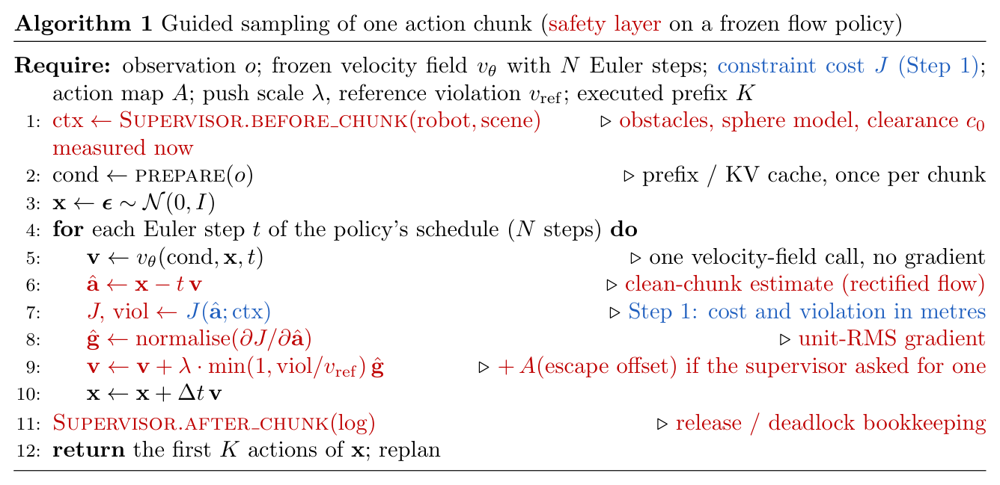


Notes: pi0.5 uses N = 10, H = 10, K = 5; GR00T N1.7 uses N = 4, H = 16, K = 8; λ = 1. Line 6 is the pi0.5 flow
convention (t: 1 → 0); GR00T's â = x + (1 − t)·v is handled by its adapter, the rest is identical.

In the code, lines 3–11 are `Guide.sample` (`safeguide/core/guide.py`) and lines 2 and 12 are the `Supervisor`
(`safeguide/core/supervisor.py`). A policy is plugged in through a `FlowPolicyAdapter` (`safeguide/adapters/base.py`)
that provides `prepare`, `velocity`, `sample_noise`, the flow time convention, the action map, and `install`, which
routes the policy's own inference call through Algorithm 1. Two adapters ship with the package; the templates in
`examples/` show how to write one for another policy.


### Example A — pi0.5 (openpi, PyTorch) + guidance

Python (the policy's own `infer` call becomes the guided one):

```python
import safeguide as sg
adapter = sg.Pi05Adapter(policy, norm_stats, G)          # openpi Policy, its norm stats, calibrated 3x3 gain G
layer = sg.SafeGuide(adapter, sg.MujocoPandaRobot(env), scene,
                     sg.GuideConfig.sota(), sg.SupervisorConfig.pillar_sota(exec_steps=5)).install()
for episode in episodes:
    layer.reset_episode(gate_line)                       # (c_xy, d_xy, offset) or None
    while not done:
        if not plan:
            layer.before_chunk(gripper_closed)           # Algorithm 1, line 2
            chunk = policy.infer(obs)["actions"]         # the policy's own call, now guided (lines 1, 3-11)
            layer.after_chunk()                          # line 12
            plan.extend(chunk[:5])
        env.step(plan.popleft())
```

Command line (LIBERO, two pillars forming a gate; the configuration used in the Results):

```bash
python benchmarks/eval_obstacle.py --suite libero_spatial --layout gate --gate_half_gap 0.17 --clean_gate 0.075 \
    --guidance g1 --scale 1.0 --grad_through_model 0 --cost_type cbf --margin_grip 0.010 --margin_arm 0.015 \
    --model_object 1 --arm_motion jac --arm_release 1 --escape_chunks 4 \
    --baseline_dir runs/baseline --calib runs/baseline/libero_spatial/action_model_calibration.npz --out runs/pi05_gate17
```

Moving human arm (Example 2, constant-velocity prediction, tight margin):

```bash
python benchmarks/eval_obstacle.py --suite libero_spatial --extra_steps 100 --layout hand --hand_motion sweep --hand_visible 1 \
    --guidance g1 --scale 1.0 --grad_through_model 0 --cost_type cbf --margin_grip 0.010 --margin_arm 0.015 \
    --model_object 1 --arm_motion jac --hand_predict cv --margin_hand 0.0 --hand_margin_tau 0.1 \
    --baseline_dir runs/baseline --calib runs/baseline/libero_spatial/action_model_calibration.npz --out runs/pi05_hand
```

These are the exact settings of the "+ safety layer" rows in the Results; the tables repeat each command for
`--suite libero_spatial` and `--suite libero_object` with `--torch_seed 0`, `1` and `2`. `--guidance none` gives the
frozen-policy reference. Both commands need obstacle-free baseline rollouts first
(`benchmarks/eval_libero.py`): the obstacles are placed relative to those paths and the action gain `G` is fitted on
them (`benchmarks/calibrate_action_model.py`).

### Example B — GR00T N1.7 + guidance

GR00T's action head (`GrootN1Adapter`) runs 4 Euler steps with t: 0→1 and a 40-step chunk of which 16 carry actions;
the same Algorithm 1 applies with `FlowSpec` = `GROOT_FLOW` and `DeltaEEFMap(min, max, G, n_valid=16)`. Because the
GR00T stack lives in its own Python environment, the layer runs inside a policy server and the evaluator talks to it
over zmq (`safeguide/remote.py`, `safeguide/server/groot_server.py`):

```bash
# GR00T environment: guided policy server (one per checkpoint x guidance mode)
PYTHONPATH=<repo> python safeguide/server/groot_server.py \
    --model-path checkpoints/GR00T-N1.7-LIBERO/libero_spatial --port 5561 --guidance g1

# evaluator environment: obstacle-free baselines once, then the same benchmark command with --policy groot (GR00T executes 8 of 16 steps)
python benchmarks/eval_libero.py --policy groot --groot_port 5561 --suite libero_spatial --replan_steps 8 --out runs/baseline_groot
python benchmarks/eval_obstacle.py --policy groot --groot_port 5561 --replan_steps 8 --baseline_dir runs/baseline_groot \
    --suite libero_spatial --layout gate --gate_half_gap 0.17 --clean_gate 0.075 \
    --guidance g1 --scale 1.0 --grad_through_model 0 --cost_type cbf --margin_grip 0.010 --margin_arm 0.015 \
    --model_object 1 --arm_motion jac --arm_release 1 --escape_chunks 4 \
    --calib runs/baseline_groot/libero_spatial/action_model_calibration.npz --out runs/groot_gate17
```

The public `nvidia/GR00T-N1.7-LIBERO` checkpoints need their backbone path pointed at a local Qwen3-VL-2B-Instruct
copy (`config.json` `model_name` and `processor_config.json` `processor_kwargs.model_name`).

---

## 📊 Results

**Key observation.** Without the safety layer, the pretrained VLA policies fail to satisfy the inference-time
constraints even though the obstacles are in their camera view: they collide with the static and the dynamic
obstacles in most episodes. With the safety layer, the safe success rate rises and the violation rate drops 3–25x
for both policies and all five layouts, at a cost of 10–50 ms per policy call for the pillars (more for the moving
arm, whose capsules are predicted over the chunk).

### (1) Safety layer on pi0.5 and GR00T N1.7

Each clip: left = frozen policy, right = frozen policy + safety layer, same task, same obstacle placement, same noise
seed. Red border = physics contact with the obstacle; the timeline shows the gripper clearance.

<table>
<tr><td width="50%" align="center">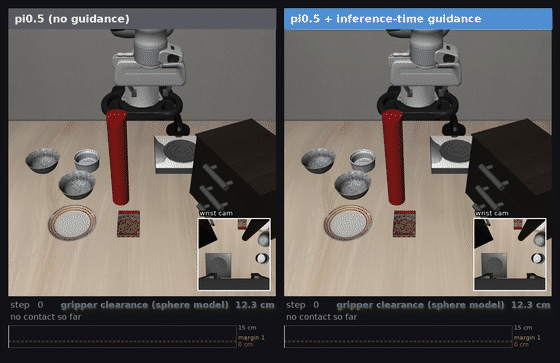<br><sub>pi0.5 — one pillar on the grasp path</sub></td><td width="50%" align="center">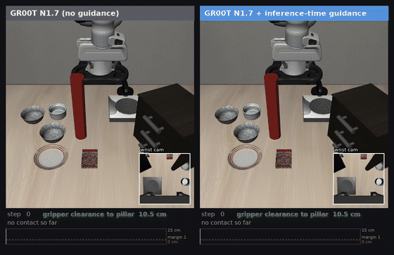<br><sub>GR00T N1.7 — one pillar on the grasp path</sub></td></tr>
<tr><td width="50%" align="center">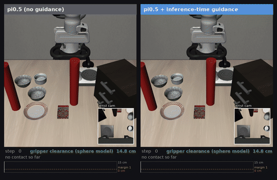<br><sub>pi0.5 — two pillars, gate ±17 cm</sub></td><td width="50%" align="center">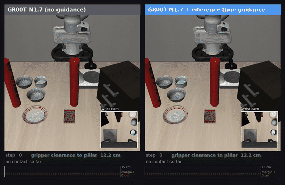<br><sub>GR00T N1.7 — two pillars, gate ±17 cm</sub></td></tr>
<tr><td width="50%" align="center">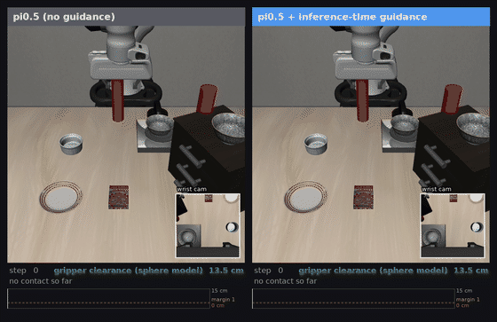<br><sub>pi0.5 — two pillars, gate ±20 cm</sub></td><td width="50%" align="center"><br><sub>GR00T N1.7 — two pillars, gate ±20 cm</sub></td></tr>
<tr><td width="50%" align="center">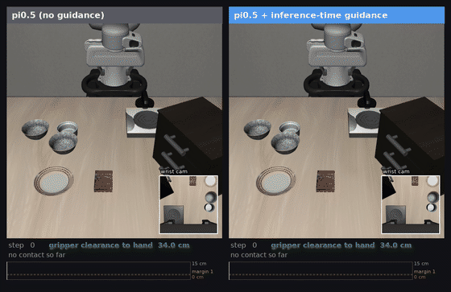<br><sub>pi0.5 — human arm sweeping across the workspace</sub></td><td width="50%" align="center">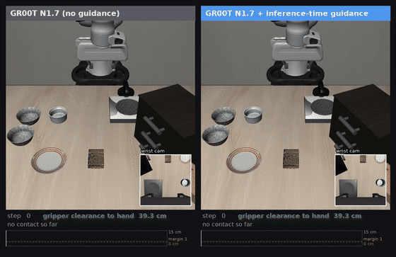<br><sub>GR00T N1.7 — human arm sweeping across the workspace</sub></td></tr>
<tr><td width="50%" align="center">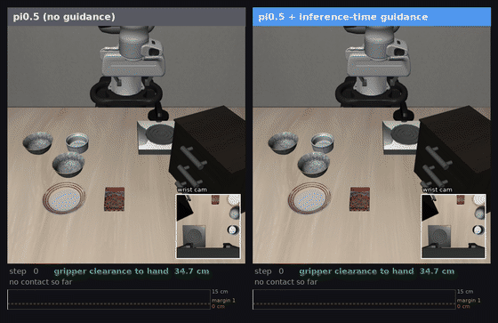<br><sub>pi0.5 — human arm reaching for the same object</sub></td><td width="50%" align="center">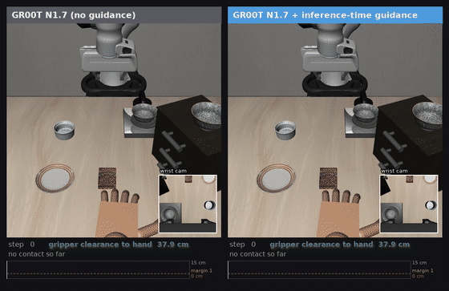<br><sub>GR00T N1.7 — human arm reaching for the same object</sub></td></tr>
</table>

<sub>LIBERO-spatial + LIBERO-object, obstacles placed on the frozen policy's own path (unseen in training), 3 noise seeds,
paired episodes (same placement and seed for every arm). *Safe success* = task completed with no physics contact
with the obstacle; *violation* = any contact; the remainder are *state OOD* (no contact, task not completed).

**pi0.5** (10 Euler steps, replan every 5 steps)

| Constraint / layout | n | frozen pi0.5 (safe success / violation) | + safety layer (safe success / violation) | latency per call |
|---|---|---|---|---|
| Static: two pillars, gate ±17 cm | 207 | 55.1 % / 44.0 % | **73.9 % / 16.4 %** | 0.29 → 0.32 s |
| Static: two pillars, gate ±20 cm | 261 | 68.6 % / 29.9 % | **76.6 % / 10.0 %** | 0.33 → 0.34 s |
| Static: one pillar on the grasp path | 408 | 0.0 % / 100 % | **12.5 % / 20.8 %** | 0.47 → 0.71 s |
| Dynamic: hand sweeping | 295 | 4.1 % / 95.9 % | **44.7 % / 16.9 %** | 0.38 → 0.48 s |
| Dynamic: hand reaching | 295 | 2.0 % / 98.0 % | **39.3 % / 3.7 %** | 0.37 → 0.44 s |


**GR00T N1.7** (4 Euler steps, replan every 8 steps, same constraints and margins, no re-tuning)

| Constraint / layout | n | frozen GR00T (safe success / violation) | + safety layer (safe success / violation) | latency per call |
|---|---|---|---|---|
| Static: gate ±17 cm | 210 | 58.1 % / 41.4 % | **64.3 % / 15.2 %** | 0.14 → 0.15 s |
| Static: gate ±20 cm | 258 | 66.7 % / 30.6 % | **73.3 % / 14.3 %** | 0.15 → 0.16 s |
| Static: one pillar | 402 | 0.0 % / 99.5 % | **7.5 % / 11.4 %** | 0.19 → 0.24 s |
| Dynamic: hand sweeping | 586 | 4.3 % / 95.2 % | **15.2 % / 19.1 %** | 0.18 → 0.38 s |
| Dynamic: hand reaching | 583 | 2.2 % / 97.4 % | **16.6 % / 4.3 %** | 0.15 → 0.41 s |


### (2) Guidance alone vs. guidance + CAR correction

The off-manifold correction term (CAR, Step 2) targets action-level errors: naively steering the velocity can push
the action chunk off the policy's data manifold. CAR adds a correction vector `u` that is learned online from
candidate chunks generated by the policy's own flow, so it pulls the action towards chunks the policy can actually
produce. When the failure really is an off-manifold action, this recovers it:

<p align="center">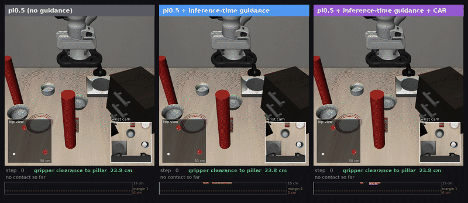<br>
<sub>Two pillars (gate ±20 cm). Left: frozen pi0.5; middle: + guidance; right: + guidance + CAR. Top-view inset: pillars, end-effector trail;
orange = guidance push in the current chunk, purple arrow = CAR correction (×3). In this seed guidance alone goes state OOD after the detour (220 steps, no contact, task not completed) and CAR completes the task in 111 steps.</sub></p>

| | pi0.5 | + guidance | + guidance + CAR |
|---|---|---|---|
| Single obstacle — safe success | 0.0 % | 12.5 % | **13.7 %** |
| Single obstacle — violation | 100 % | 20.8 % | **20.1 %** |
| Gate ±17 cm — safe success | 55.1 % | **73.9 %** | 69.1 % |
| Gate ±17 cm — violation | 44.0 % | **16.4 %** | 19.8 % |
| Gate ±20 cm — safe success | 68.6 % | **76.6 %** | 75.9 % |
| Gate ±20 cm — violation | 29.9 % | 10.0 % | **8.8 %** |
| Policy-call latency | **0.29–0.47 s** | 0.32–0.71 s | 1.8–2.3 s |

<sub>n = paired episodes (placements × 3 seeds, LIBERO-spatial + LIBERO-object): single 408, gate ±17 cm 207, gate ±20 cm 261.
Differences between + guidance and + guidance + CAR are within noise except gate ±17 cm, where CAR is slightly worse.

### （3）Some failure cases
However, state OOD is the main cause of failure (the remaining failures are unsafe successes,
i.e. constraint violations). As in the clips below, after the guidance has steered the action the robot is in a state
the policy never saw, and it fails.

<table><tr><td width="25%" align="center">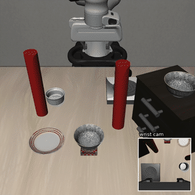<br><sub>state OOD 1 — bowl on the cookie box</sub></td><td width="25%" align="center">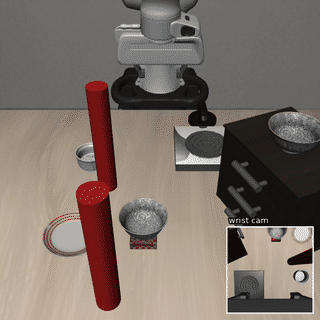<br><sub>state OOD 2 — bowl on the cookie box</sub></td><td width="25%" align="center">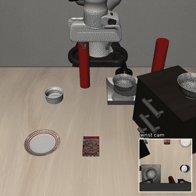<br><sub>state OOD 3 — bowl on the stove</sub></td><td width="25%" align="center">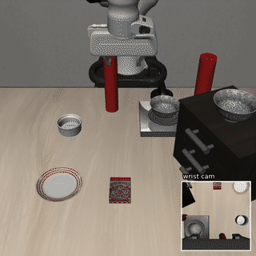<br><sub>state OOD 4 — bowl on the stove</sub></td></tr></table>
<sub>GR00T N1.7 + safety layer, gate ±17 cm, seed 0: no contact, task not completed within 220 steps.</sub>


### Conclusion

Steering a frozen policy at inference time easily leads to state OOD. An action-level off-manifold
correction such as CAR generally does not help with it; the only remedy
is to bring the robot back to a state the policy knows. Most tasks show no strong conflict, and CAR triples the policy-call latency, so we suggest deploying the guidance layer
without CAR.
