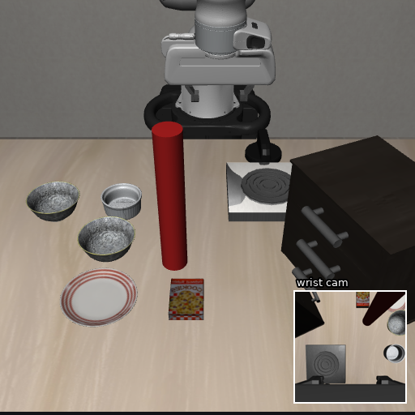
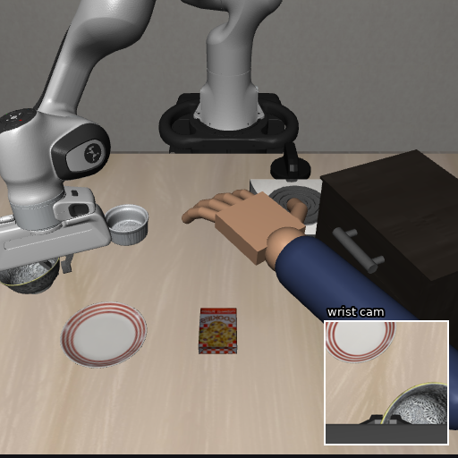

# robot_safety_layer

More and more robots are controlled by learning-based policies. How can we guarantee their safety at runtime?
This repository is about the **safety of learning-based policies**.

Our solution is a plug-in **safety layer for frozen flow-matching VLA policies** (e.g., pi0.5, GR00T N1.7). It acts
at inference time and never changes the pretrained weights of the policy.


The setup has two components:

1. **Runtime safety constraints.** At inference time you define the constraints the robot must satisfy as
   differentiable cost functions on the action chunk. We provide two examples: static obstacles (e.g., assets in the
   environment) and dynamic obstacles (e.g., a human moving in the shared workspace). Details in
   [Step 1 — Constraint functions](#-step-1--constraint-functions).
2. **Your pretrained policy + our safety layer.** Details in
   [Step 2 — Incorporating the safety layer into a flow policy](#%EF%B8%8F-step-2--incorporating-the-safety-layer-into-a-flow-policy).
   The layer steers the output of the VLA policy by adding to its base velocity (1) a **guidance term** `g` from the
   constraint cost and (2) optionally an **off-manifold correction term** `CAR`, because naively editing the action
   can push it off the action manifold. In most environments the guidance term alone already raises the safe
   success rate and lowers the violation rate; the correction term can fix some corner cases of off-manifold
   drift but costs a lot of latency, so in most cases the guidance term alone is the right choice.

We evaluate on LIBERO with the two constraints (static pillars, a moving human arm) for pi0.5 and GR00T N1.7
([Results](#-results)).

```
safeguide/     the safety layer (pip install -e .)
examples/      porting templates: policy adapter, robot model, scene, custom cost, control loop
benchmarks/    the LIBERO evaluator used for the results below (pillars, moving hand, action-gain calibration)
```

**Porting to another policy, simulator or real robot** means implementing one of four small interfaces
(`FlowPolicyAdapter`, `RobotModel`, `Scene`, or a `cost_fn`) and calibrating one 3x3 action gain; see
[`safeguide/README.md`](safeguide/README.md) ("where things live") and the templates in [`examples/`](examples/).

---

## 🧱 Step 1 — Constraint functions

A constraint is a cost `J(â)` on the **clean action chunk estimate** `â` (H steps of the policy's action space).
The layer turns `â` into world-frame geometry through two fixed pieces and then applies the constraint:

* `ActionMap` (`safeguide/core/cost.py`): normalised actions → end-effector path `p_h`, h = 1..H
  (`DeltaEEFMap` for delta-EEF policies; a Jacobian map for joint-space policies).
* `RobotModel` (`safeguide/robot/`): collision spheres of the gripper, forearm links and the held object, moved with
  the end effector by a Jacobian model `x_hp = x_0p + M_p (p_h − p_0)`.

Both built-in examples share one **discrete-time barrier** on the clearance `c_khp` between sphere `p` and obstacle
`k` at chunk step `h` (margins `m_p` = 1.0 cm gripper / 1.5 cm arm, `d_safe` = 3 cm, γ = 0.3, weights `w_h` = 1 on
the executed steps and 0.3 on the tail; `c0` is the clearance measured at the chunk start):

```
f_khp = min(d_safe, m_p + (1 − γ)^(h+1) · relu(c0_kp − m_p))          barrier floor
J(â)  = Σ_k Σ_h w_h Σ_p relu(f_khp − c_khp)²                          constraint cost
```

Far spheres may approach at a rate proportional to their clearance, spheres that keep their distance are never
penalised, and the margin itself is never crossed.

<table><tr>
<td width="50%"><br><sub><b>Example 1</b> — static obstacles: pillars placed on the policy's own approach path (unseen in training)</sub></td>
<td width="50%"><br><sub><b>Example 2</b> — dynamic obstacle: a human arm sweeping across / reaching into the workspace</sub></td>
</tr></table>

### Example 1 — static obstacles (`StaticObstacleTask`)

Obstacles are z-aligned cylinders `(c_k, R_k, H_k)` read from the scene (pillars, fixtures, table edges):

```
c_khp = SDF_cyl_k(x_hp) − r_p
```

Episode heuristics attached to this task: arm-margin release once the end effector has passed the obstacle line
(+3 cm hysteresis) and a deadlock escape (lift 1.5 cm per step for 2 chunks when the guidance has been active for 4
chunks without progress).

### Example 2 — dynamic obstacle, a human arm (`DynamicObstacleTask`)

A human arm is tracked as two capsules (elbow → wrist, wrist → fingertip). Their poses are predicted over the chunk
(`a_k(h), b_k(h)`, h = 1..H, constant-velocity extrapolation of the tracked points) and their radii are inflated by
a human-safety margin and a reaction-time allowance:

```
R_k   ← R_k + m_hand + |v_tip| · τ                 ("tight": m_hand = 0, τ = 0.1 s;  "safe": 3 cm, 0.2 s)
c_khp = SDF_cap(x_hp; a_k(h), b_k(h)) − r_p − R_k
```

No release and no escape: retreating and waiting for the arm to pass is the desired behaviour.

```python
import safeguide as sg
layer = sg.compose(adapter, robot, sg.StaticObstacleTask(scene)).install()       # example 1
layer = sg.compose(adapter, robot, sg.DynamicObstacleTask.tight()).install()     # example 2 (feed .track.observe(elbow, tip) every step)
layer = sg.compose(adapter, robot, static_task, dynamic_task).install()          # both: J = J_s + J_d
```

### Define your own constraint

Two entry points, from light to full control:

**(a) New obstacle geometry, same barrier.** Implement the `Scene` interface (`safeguide/scene/base.py`): return
cylinders and/or capsules (with predicted poses over the chunk). Anything a perception front end produces as
primitives plugs in here without touching the cost.

```python
class MyScene(sg.Scene):
    def cylinders(self):            # (centers (K, 3), radii (K,), half_heights (K,))
        ...
    def capsules(self, horizon):    # None, or (a (K2, H+1, 3), b (K2, H+1, 3), r (K2,)) at chunk steps 0..H
        ...
```

**(b) Any differentiable cost.** Pass `cost_fn(a_hat, ctx, T) -> (J, violation)` to the layer: `J` is the cost per
sample (shape `(B,)`, differentiable in `a_hat`), `violation` (metres, `(B,)`) scales the push through
`min(1, violation / v_ref)` exactly like the built-in barrier. Helpers give you the geometry of the chunk:

```python
import torch, safeguide as sg
from safeguide.core.cost import chunk_eef_positions, sphere_positions, step_weights

def keep_above_table(a_hat, ctx, T, z_min=0.02):
    """End effector must stay above z_min (world frame)."""
    p = chunk_eef_positions(a_hat, ctx, T)                 # (B, H, 3) end-effector path implied by the chunk
    viol = torch.relu(z_min - p[..., 2])                   # (B, H)
    w = step_weights(ctx, p.shape[1], p.device)            # 1 on executed steps, 0.3 on the tail
    return (w * viol**2).sum(1), viol.amax(1)

layer = sg.SafeGuide(adapter, robot, scene, cost_fn=keep_above_table).install()
```

`sphere_positions(p, T)` gives the robot spheres along the path if the constraint concerns the whole arm; `ctx`
carries the margins, `d_safe`, `cbf_vref` and the executed-prefix length; `T` the tensors of the current chunk.

---

## 🛡️ Step 2 — Incorporating the safety layer into a flow policy

The policy's sampler integrates a velocity field `v_θ(x_t, t | obs)` from noise to the action chunk. The layer
wraps that loop (Algorithm 1). `t` runs in the policy's own convention (`FlowSpec`: 1→0 for openpi, 0→1 for GR00T);
`λ` is the push scale (1.0); `normalise` rescales the gradient to unit RMS and multiplies it by `min(1, violation / v_ref)`
with `v_ref` = 1 cm (minimal intervention: a 1 mm violation gets a 10x smaller push than a 1 cm one).


LaTeX source with the same colour code: [`docs/algorithm1.tex`](docs/algorithm1.tex). Red lines are the safety layer
(this package); the purple term in line 10 is the optional learned correction (CAR), which is off (`gate(ctx) = 0`) in
every configuration used in this README. Notes: pi0.5 uses N = 10, H = 10, K = 5; GR00T N1.7 uses N = 4, H = 16,
K = 8; λ = 1. Line 6 is the pi0.5 flow convention (t: 1 → 0); GR00T's â = x + (1 − t)·v is handled by its adapter,
the rest is identical.

Lines 5–11 are `Guide.sample` (`safeguide/core/guide.py`); line 2 and the `after_chunk` call in line 12 are the
`Supervisor` (`safeguide/core/supervisor.py`). A model is plugged in through a `FlowPolicyAdapter`
(`safeguide/adapters/base.py`): `prepare`, `velocity`, `sample_noise`, `flow` (time convention), `action_map`, and
`install` (how the policy's own sampler is replaced). Two adapters exist.

### Example A — pi0.5 (openpi, PyTorch) + guidance

Python:

```python
import safeguide as sg
adapter = sg.Pi05Adapter(policy, norm_stats, G)          # openpi Policy, its norm stats, calibrated 3x3 gain G
layer = sg.SafeGuide(adapter, sg.MujocoPandaRobot(env), scene,
                     sg.GuideConfig.sota(), sg.SupervisorConfig.pillar_sota(exec_steps=5)).install()
for episode in episodes:
    layer.reset_episode(gate_line)                       # (c_xy, d_xy, offset) or None
    while not done:
        if not plan:
            layer.before_chunk(gripper_closed)           # Algorithm 1, line 1
            chunk = policy.infer(obs)["actions"]         # the policy's own call, now guided (lines 2-10)
            layer.after_chunk()                          # line 11
            plan.extend(chunk[:5])
        env.step(plan.popleft())
```

Command line (LIBERO, two pillars forming a gate; the configuration used in Step 3):

```bash
python benchmarks/eval_obstacle.py --suite libero_spatial --layout gate --gate_half_gap 0.17 --clean_gate 0.075 \
    --guidance g1 --scale 1.0 --grad_through_model 0 --cost_type cbf --margin_grip 0.010 --margin_arm 0.015 \
    --model_object 1 --arm_motion jac --arm_release 1 --escape_chunks 4 \
    --calib runs/baseline/libero_spatial/action_model_calibration.npz --out runs/pi05_gate17
```

Moving human arm (Example 2, constant-velocity prediction, tight margin):

```bash
python benchmarks/eval_obstacle.py --suite libero_spatial --extra_steps 100 --layout hand --hand_motion sweep --hand_visible 1 \
    --guidance g1 --scale 1.0 --grad_through_model 0 --cost_type cbf --margin_grip 0.010 --margin_arm 0.015 \
    --model_object 1 --arm_motion jac --hand_predict cv --margin_hand 0.0 --hand_margin_tau 0.1 \
    --calib runs/baseline/libero_spatial/action_model_calibration.npz --out runs/pi05_hand
```

`--guidance none` gives the frozen-policy reference. The obstacle-free baselines the placements and the gain `G`
are derived from come from `benchmarks/eval_libero.py` and `benchmarks/calibrate_action_model.py`.

### Example B — GR00T N1.7 + guidance

GR00T's action head (`GrootN1Adapter`) runs 4 Euler steps with t: 0→1 and a 40-step chunk of which 16 carry actions;
the same Algorithm 1 applies with `FlowSpec` = `GROOT_FLOW` and `DeltaEEFMap(min, max, G, n_valid=16)`. Because the
GR00T stack lives in its own Python environment, the layer runs inside a policy server and the evaluator talks to it
over zmq (`safeguide/remote.py`, `safeguide/server/groot_server.py`):

```bash
# GR00T environment: guided policy server (one per checkpoint x guidance mode)
PYTHONPATH=<repo> python safeguide/server/groot_server.py \
    --model-path checkpoints/GR00T-N1.7-LIBERO/libero_spatial --port 5561 --guidance g1

# evaluator environment: obstacle-free baselines once, then the same benchmark command with --policy groot
python benchmarks/eval_libero.py --policy groot --groot_port 5561 --suite libero_spatial --replan_steps 8 --out runs/baseline_groot
python benchmarks/eval_obstacle.py --policy groot --groot_port 5561 --replan_steps 8 --baseline_dir runs/baseline_groot \
    --suite libero_spatial --layout gate --gate_half_gap 0.17 --clean_gate 0.075 \
    --guidance g1 --scale 1.0 --grad_through_model 0 --cost_type cbf --margin_grip 0.010 --margin_arm 0.015 \
    --model_object 1 --arm_motion jac --arm_release 1 --escape_chunks 4 \
    --calib runs/baseline_groot/libero_spatial/action_model_calibration.npz --out runs/groot_gate17
```

The public `nvidia/GR00T-N1.7-LIBERO` checkpoints need their backbone path pointed at a local Qwen3-VL-2B-Instruct
copy (`config.json` `model_name` and `processor_config.json` `processor_kwargs.model_name`).

---

## 📊 Results

LIBERO-spatial + LIBERO-object, obstacles placed on the frozen policy's own path (unseen in training), 3 noise seeds,
paired episodes (same placement and seed for every arm). *Safe success* = task completed with no physics contact
with the obstacle; *violation* = any contact; the remainder did not complete the task without contact.

**pi0.5** (10 Euler steps, replan every 5 steps)

| Constraint / layout | n | frozen pi0.5 (safe / violation) | + safety layer (safe / violation) | latency per call |
|---|---|---|---|---|
| Static: two pillars, gate ±17 cm | 207 | 55.1 % / 44.0 % | **73.9 % / 16.4 %** | 0.29 → 0.32 s |
| Static: two pillars, gate ±20 cm | 261 | 68.6 % / 29.9 % | **76.6 % / 10.0 %** | 0.33 → 0.34 s |
| Static: one pillar on the grasp path | 408 | 0.0 % / 100 % | 12.5 % / 20.8 % | 0.47 → 0.71 s |
| Dynamic: hand sweeping across the workspace | 295 | 4.1 % / 95.9 % | **44.7 % / 16.9 %** | 0.38 → 0.48 s |
| Dynamic: hand reaching for the same object | 295 | 2.0 % / 98.0 % | **39.3 % / 3.7 %** | 0.37 → 0.44 s |

**GR00T N1.7** (4 Euler steps, replan every 8 steps, same constraints and margins, no re-tuning)

| Constraint / layout | n | frozen GR00T (safe / violation) | + safety layer (safe / violation) |
|---|---|---|---|
| Static: gate ±17 cm | 210 | 58.1 % / 41.4 % | **64.3 % / 15.2 %** |
| Static: gate ±20 cm | 258 | 66.7 % / 30.6 % | **73.3 % / 14.3 %** |
| Static: one pillar | 402 | 0.0 % / 99.5 % | 7.5 % / 11.4 % |
| Dynamic: hand sweeping | 586 | 4.3 % / 95.2 % | **15.2 % / 19.1 %** |
| Dynamic: hand reaching | 583 | 2.2 % / 97.4 % | **16.6 % / 4.3 %** |

Violations drop 3–25x under every constraint and for both policies. The residual failures are stalls: after the
detour the robot is in a state the frozen policy never saw and it does not complete the task. Replanning every
2 steps hurts (more push/pull cycles), every 8 is no better; a learned correction vector (CAR, kept in
`benchmarks/guidance.py` for reference, `--guidance car`) does not change the outcome and triples the latency, so
none of the commands above enable it.

`benchmarks/eval_obstacle.py` writes one JSON line per episode (outcome, contact steps, min clearance, per-chunk
logs); the tables above are paired McNemar tests over those records.
